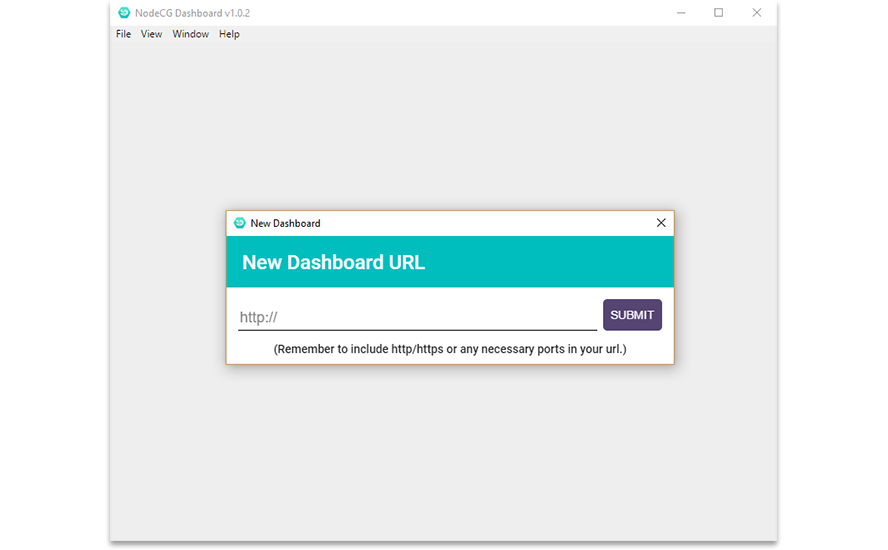

# Standalone NodeCG Dashboard

> A standalone application for displaying a NodeCG Dashboard.

## Motivation
There was a brief period of time where NodeCG versions prior to 0.7 did not work in the latest version of Chrome. In an attempt to resolve this issue, the NodeCG team simultaneously worked on two separate solutions:

1. Find a working `Object.observe` polyfill that was compatible with NodeCG's use case.
2. Create a standalone electron application pinned to Chrome 49, the last version to support `Object.observe`.

We wound up having success with finding a working polyfill, and this standalone application ended up not being necessary. For the time being, this standalone app will remain on Chrome 49. At some point in the future, we may decide to drop support for these old versions of NodeCG which don't have the `Object.observe` polyfill. Since 0.7, NodeCG has used `Proxy` instead of `Object.observe`, and works natively in Chrome 49 and newer.

## Installation
Check the [Releases](https://github.com/nodecg/dashboard/releases) page to grab the latest installer for your operating system.
Once installed, the application will autoupdate.

## Credits
Developed by [Alex Van Camp](https://twitter.com/vancamp)  
Designed by [Chris Hanel](https://twitter.com/chrishanel)

## License
NodeCG is provided under the MIT license, which is available to read in the 
[LICENSE](https://github.com/nodecg/dashboard/blob/master/LICENSE) file.
